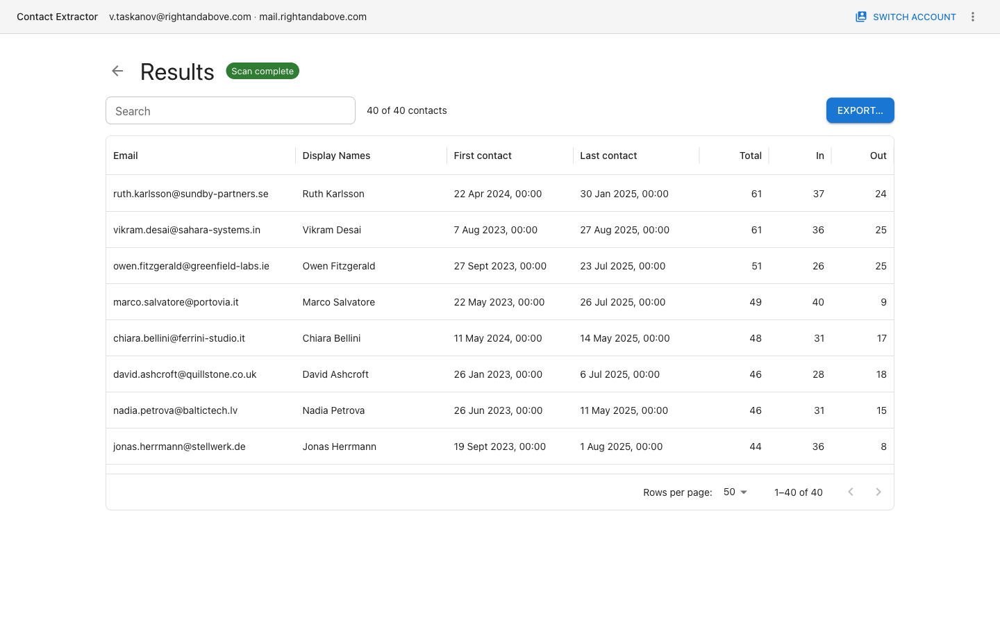

# Contact Extractor

Desktop app that connects to an IMAP mailbox, walks every folder, and extracts the
people you actually correspond with — filtering out newsletters, robots and internal
traffic — then exports the result to XLSX or CSV.

Everything runs locally. The only network connection the app makes is outbound IMAP
to your own server: no cloud service, no telemetry, no auto-update.

White paper: [WHITEPAPER.md](WHITEPAPER.md).



## Install

Prebuilt packages: macOS (`.dmg`, Intel and Apple Silicon), Windows (NSIS installer and
portable `.exe`), Linux (`AppImage` and `.deb`, x86_64).

The builds are unsigned, so the OS will warn on first launch:

- **macOS** — right-click the app → “Open” (ad-hoc signature, no Developer ID).
- **Windows** — SmartScreen → “More info” → “Run anyway”.
- **Linux** — `chmod +x` the AppImage, or `sudo apt install ./contact-extractor-*.deb`.

## How it works

1. **Connect** — host, port, TLS, username, password. Sign-in is IMAP username and
   password only: there is no OAuth flow and no SSO. Gmail and Outlook.com therefore
   need an app password, and mailboxes that only accept token-based sign-in cannot be
   connected. Tick “Remember me” and the password is encrypted by the OS keystore
   (Keychain, DPAPI, libsecret) — never written to disk in plaintext.
2. **Scan** — choose folders and filters, then let it run. Message headers are fetched
   by default; bodies only if you explicitly enable “Parse message bodies”.
3. **Results** — a searchable table of contacts, a per-contact drill-down into the
   messages behind each row, and export to XLSX or CSV.

### Who counts as a contact

A contact is kept when **all** of these hold:

- **Bidirectional** — at least one inbound and one outbound message (configurable:
  one-directional, or off entirely).
- **External** — the domain is not in your exclude list.
- **Not automated** — not every message from them carries `Auto-Submitted`,
  `Precedence: bulk/list/junk`, `List-Unsubscribe` or `List-Id` headers, and the
  local part is not one of the configured automation names (`noreply`, `bounce`, …).
- **Not a role address** — `support@`, `info@`, `sales@` and friends are dropped
  unless you replied to that exact address yourself.

Every threshold, domain list and word list is editable on the Scan screen before
each run. Nothing is inferred by a model; the rules are deterministic and each one
has a unit test.

### Privacy

- Message headers are cached in a local SQLite database under your user profile.
- Bodies are stored only with “Parse message bodies” enabled, truncated to 256 KB and
  encrypted through the OS keystore.
- The cache can be wiped from the app in one click.
- The renderer process is sandboxed with `contextIsolation`, no Node integration, and
  a CSP that blocks remote scripts.

## Development

Requires Node.js 24.

```bash
npm install
npm run dev            # electron-vite dev server with HMR
npm test               # vitest
npm run typecheck      # tsc --noEmit
npm run lint
```

### Building installers

```bash
npm run build          # typecheck + bundle
npx electron-builder --mac dmg          # both architectures
npx electron-builder --linux AppImage
npx electron-builder --win nsis portable --x64
```

Two packaging notes:

- The `.deb` is assembled by `build/make-deb.py`, not by electron-builder. The `fpm`
  binary electron-builder bundles emits a corrupt archive when run on recent macOS.
- No DMG background image: Finder on macOS 15 and newer ignores the background
  referenced from a disk image's `.DS_Store`, so the window is sized to fit its two
  icons instead.

Artwork lives in `build/`: `icon.png` (1024×1024) is the source for every platform
icon, and `make-installer-art.py` regenerates the NSIS wizard bitmaps from it.

### Layout

```
src/main       Electron main process: IMAP, SQLite, classification pipeline, export
src/preload    contextBridge API, validated with zod on both ends
src/renderer    React UI (MUI, Redux Toolkit, redux-observable)
src/shared     IPC contracts and domain schemas shared by both sides
tests          vitest unit + integration tests
benchmarks     scan throughput harness
```

## Documentation

- [White paper](WHITEPAPER.md) — why a unique-address dump is not a contact list, the keep/drop rules, and how the local classifier implements them.

## License

MIT — see [LICENSE](LICENSE).
